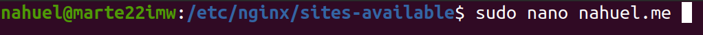
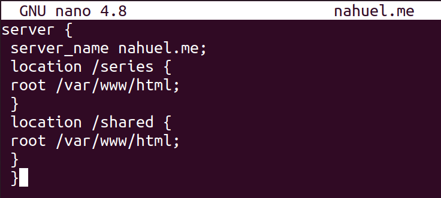
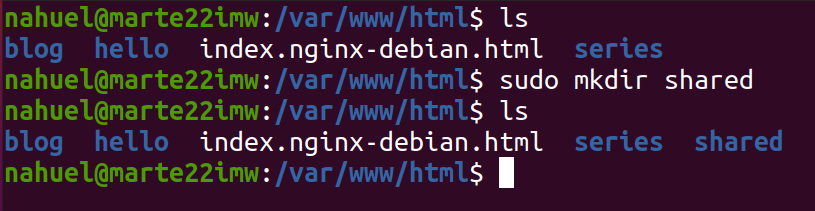
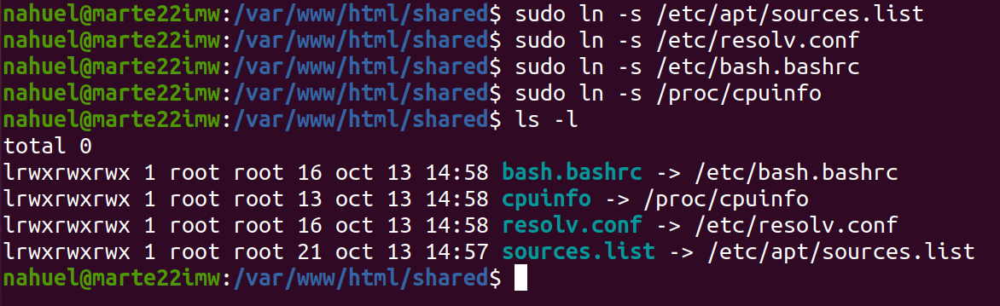
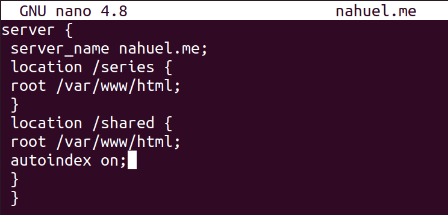
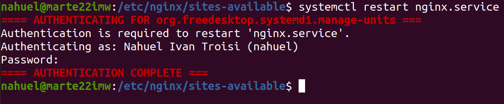
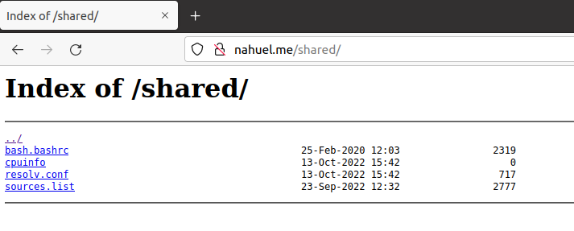

# SERVIDOR WEB - LISTADO DE DIRECTORIOS

***Nombre:*** Nahuel Ivan Troisi
 
***Curso:*** 2º de Ciclo Superior de Administración de Sistemas Informáticos en Red.

## ÍNDICE

+ [Introducción](#id1)
+ [Objetivos](#id2)
+ [Material empleado](#id3)
+ [Desarrollo](#id4)
+ [Conclusiones](#id5)

## ***Introducción***. 

Vamos a realizar una práctica en la cual vamos a ver como listar una serie de directorios con la configuración "autoindex". 

## ***Objetivos***. 

El objetivo es conseguir entrar en la página "nahuel.me/shared" y encontrar el listado de directorios correctamente configurado. 

## ***Material empleado***. 

Vamos a hacer uso de dos máquinas virtuales, una de Ubuntu Server donde se aloja el servidor nginx y la otra será de Kali Linux, la cual servirá
para poder acceder de forma remota, además de realizar el informe correspondiente. 

## ***Desarrollo***. 

Para crear un listado de directorios, primero deberemos dirigirnos al fichero de configuración "nahuel.me", el cual se encuentra
en "/etc/nginx/sites-avaliable". 

Una vez localizado el archivo, vamos a editarlo, por lo que deberemos añadir las siguientes líneas. 

Como podemos observar, hemos creado otra ruta, la cual hemos definido con el nombre "/shared". 

Una vez realizado este paso, vamos a dirigirnos al directorio "/var/www/html", donde vamos a crear la carpeta "shared", la cual
hace referencia al punto anterior ya que, para que funcione correctamente, deben de tener el mismo nombre. De lo contrario, podrían surgir conflictos. 

Posteriormente, vamos a entrar en la carpeta "shared" y vamos a realizar una serie de enlaces simbólicos hacia las rutas que se muestran a continuación. 

Ahora vamos a dirigirnos de nuevo al fichero "nahuel.me" y vamos a habilitar el "autoindex". 

Una vez realizado este paso, vamos a reiniciar el servidor de nginx. 

Finalmente, comprobamos que funciona correctamente. 

## ***Conclusiones***. 

Esta práctica ha resultado ser bastante sencilla, dado que partimos de la práctica anterior en la cual los pasos a seguir son bastante similares por lo que
la dificultad y el tiempo empleado para la misma ha sido bastante bajo.
