

# SERVIDOR WEB - HOSTS

***Nombre:*** Nahuel Ivan Troisi 

 

***Curso:*** 2º de Ciclo Superior de Administración de Sistemas Informáticos en Red.

## ÍNDICE

+ [Introducción](#id1)
+ [Objetivos](#id2)
+ [Material empleado](#id3)
+ [Desarrollo](#id4)
+ [Conclusiones](#id5)

## ***Introducción***. 

## ***Objetivos***. 

## ***Material empleado***. 

## ***Desarrollo***. 

## Sitio Web 1

En este primer sitio web vamos a crear el servidor "imw.nahuel.me" el cual va a alojar una imágen en su página principal y en un subdirectorio vamos a disponer de un
link a una página web externa. 
En primer lugar vamos a crear el servidor anteriormente mencionado. 

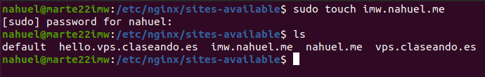

Posteriormente, vamos a editar el archivo de configuración del mismo. 

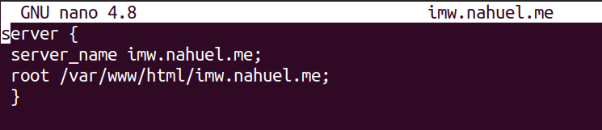

Una vez realizado, crearemos el enlace simbólico correspondiente.

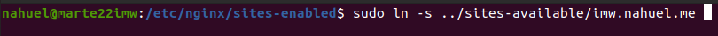

Comprobamos que se ha realizado correctamente. 

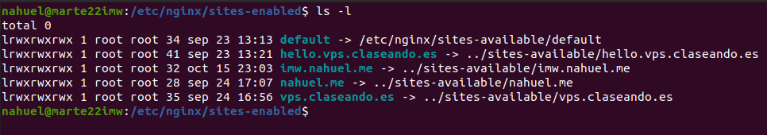

Por otro lado, procedemos a crear el subdirectorio "mec" en el directorio "/var/www/html".

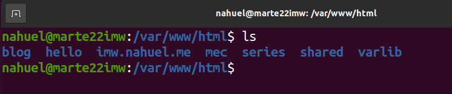

Dentro de dicho directorio, vamos a crear el archivo "index.html", el cual va a mostrarnos una portada con una imágen resumen de la asignatura de IMW. 

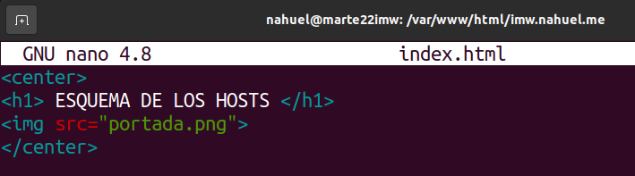

Añadimos el sitio web a nuestro directorio de "hosts". 

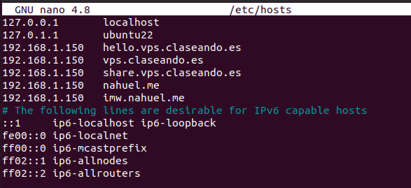

Reiniciamos el servicio. 

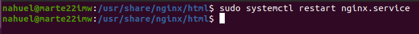

Comprobamos que ha funcionado correctamente.

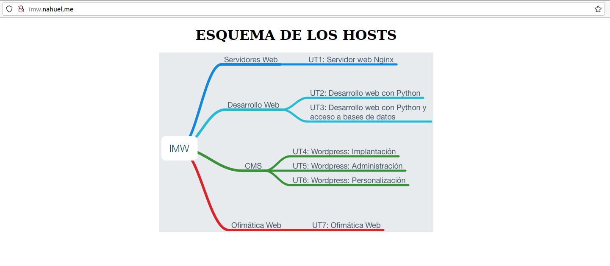
 
Para terminar, realizamos el mismo proceso de configuración del archivo "index.html" pero esta vez en el directorio "/var/www/html/mec", el cual nos va a
redirigir a un enlace externo. 

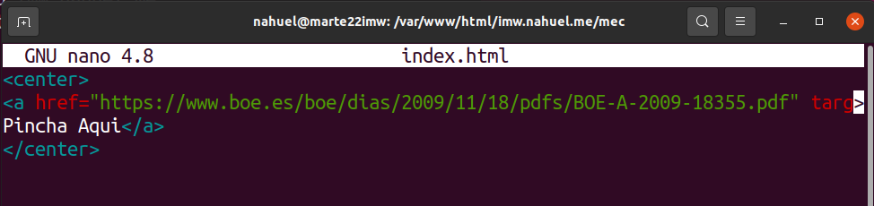

Y comprobamos que se ha realizado correctamente. 

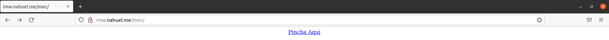

## Sitio Web 2

Respecto al segundo sitio web, éste nos mostrará un listado de archivos del directorio "/var/lib", por lo que, al igual que en el caso anterior vamos a comenzar
por configurar el servidor. 

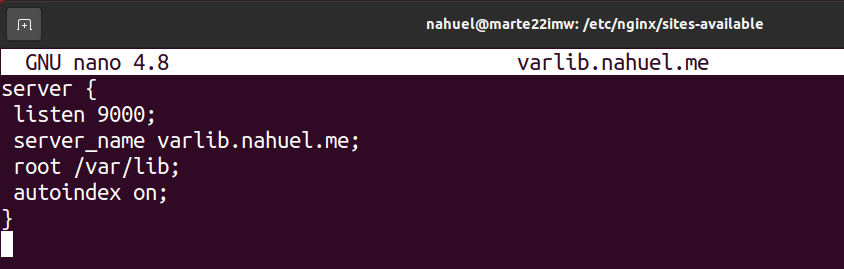

** Ojo, que hay que hacer uso del "autoindex" para que funcione **

Una vez realizado este paso, añadimos la página al listado de hosts y reiniciamos el servicio para comprobar que funciona. 

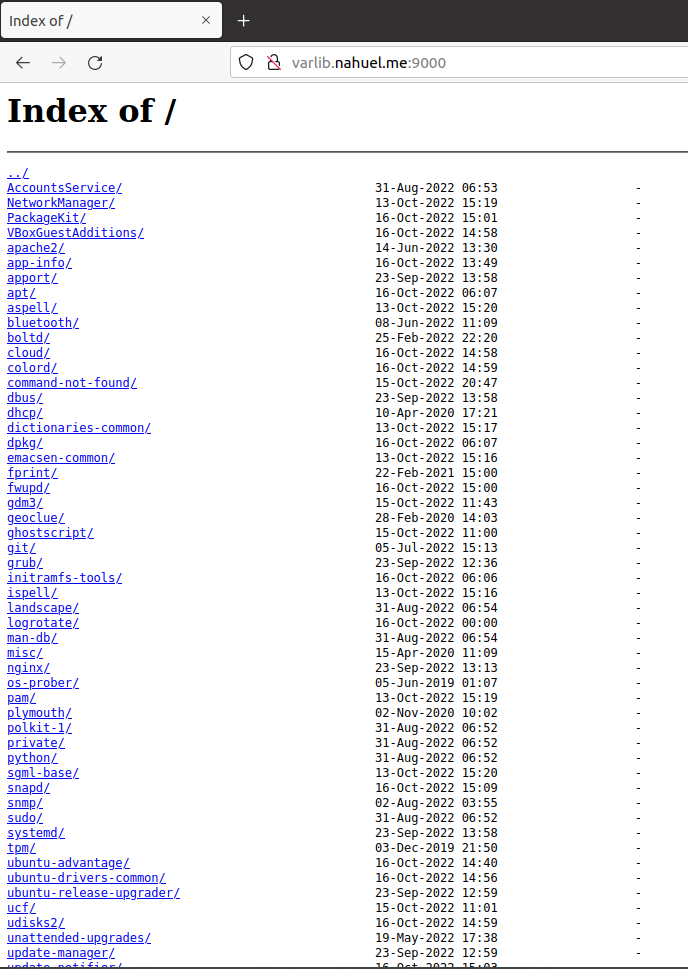

## Sitio Web 3

En el caso del tercer sitio web, este va a alojar un listado de los alumnos de 2º de ASIR, asi como los puestos en los que se encuentran, pero para poder acceder, se
necesita conocer un usuario y contraseña determinado. 
Para ello, vamos a definir los siguientes parámetros en el archivo de configuración del servidor. 

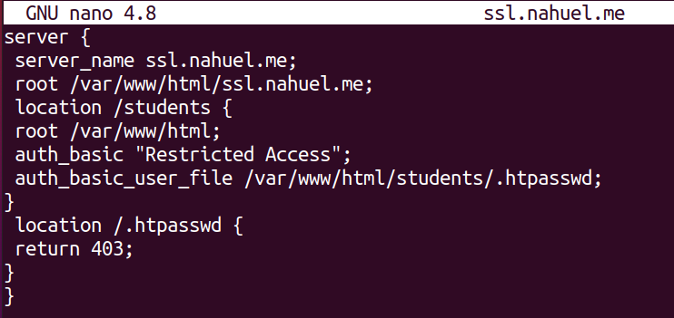

Posteriormente, vamos a encriptar la clave de acceso, la cual es "2asir". 

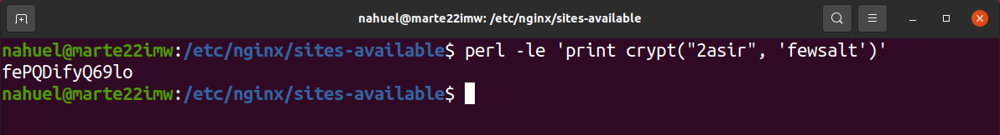

Vamos a añadir dicha clave al archivo ".htpasswd", el cual se aloja en el directorio "/var/www/html/students".

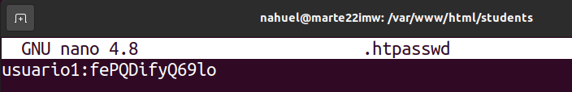

Dentro del mismo directorio, vamos a configurar el "index.html" con el listado de los alumnos.

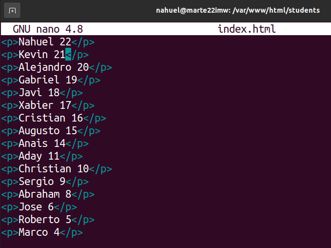

Creamos el enlace simbólico correspondiente. 

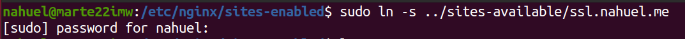

Comprobamos que se ha realizado correctamente.

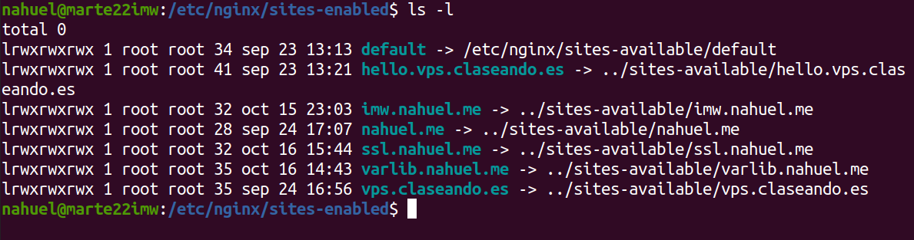

Añadimos el sitio web a nuestro directorio de "hosts". 

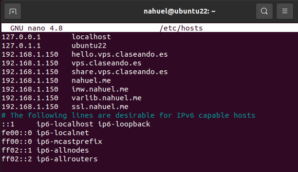

Comprobamos que podemos acceder al sitio web y que dispone de autenticación. 

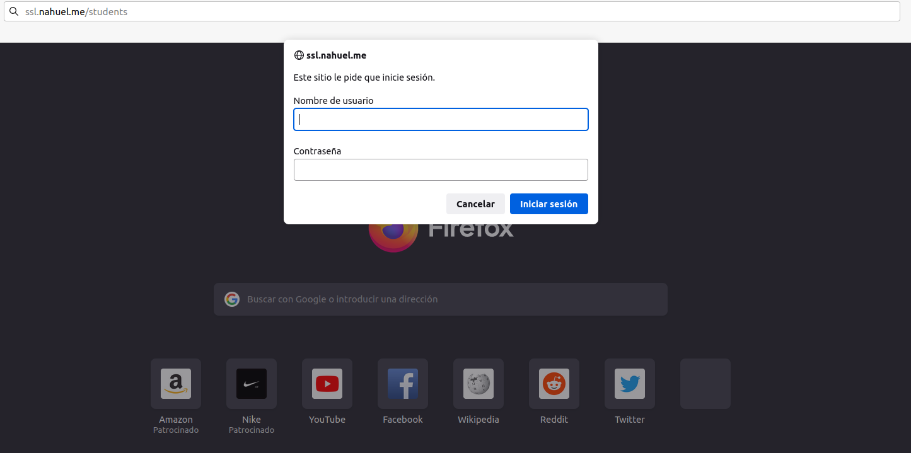

Si accedemos al mismo, podremos ver el listado de alumnos y los puestos que ocupan. 

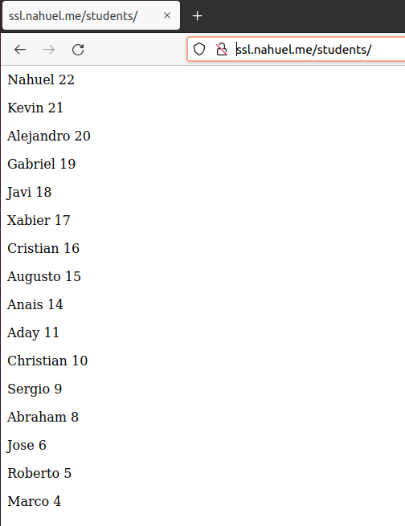

## Sitio Web 4

En este último sitio web vamos a crear una página que posea una serie de redirecciones, para que en caso de errores tipográficos o actualizaciones de nombres se pueda 
acceder a la web sin problema. 
Es por ello que vamos a configuraralo de la siguiente manera.

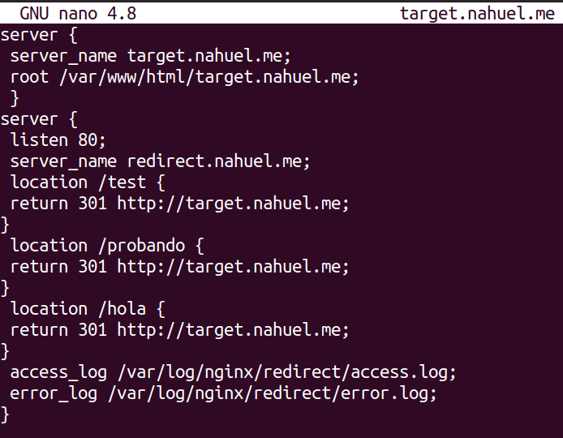

Como podemos observar, hemos configurado tres redirecciones diferentes, asi como los "access_log" y "error_log", los cuales veremos más adelante. 

Posteriormente, añadimos la página a nuestro archivo de "hosts".

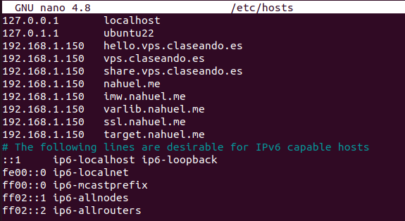

Creamos el enlace simbólico al igual que en los casos anteriores y comprobamos que se ha realizado correctamente. 

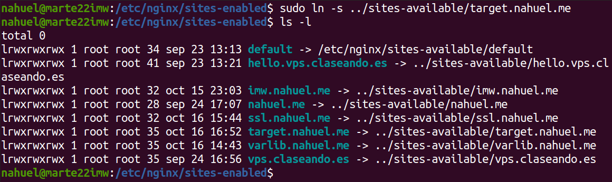

Accedemos a la web para comprobar que carga correctamente el "index.html" y sus respectivas configuraciones. 

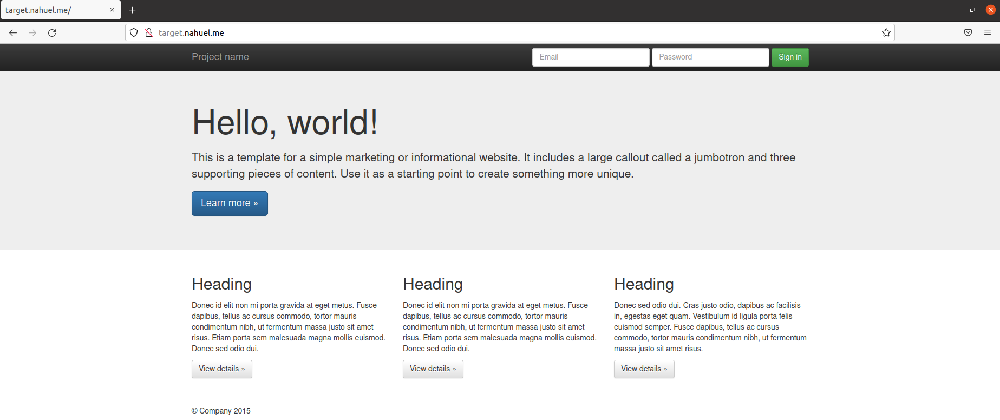

Movemos los archivos "error_log" y "access_log" al directorio "/var/log/nginx/redirect", el cual hay que crear manualmente dado que no existe por defecto. 

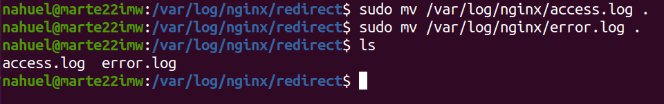

Finalmente, añadimos el sitio web de redireccionamiento al archivo "hosts" y comprobamos que se hacen las redirecciones correctamente. 

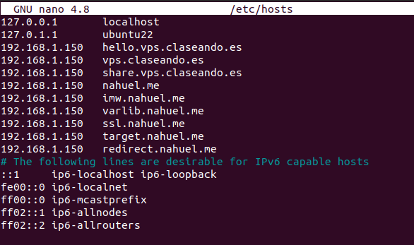

## ***Conclusiones***. 
